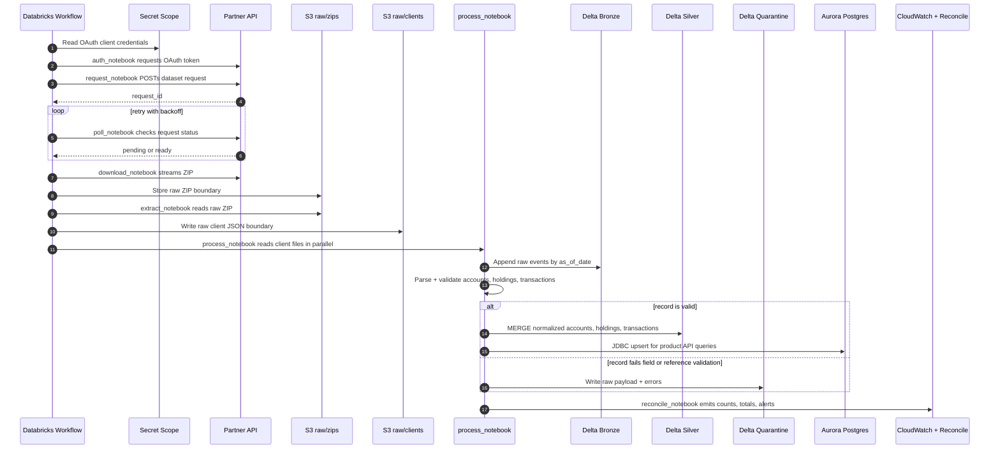
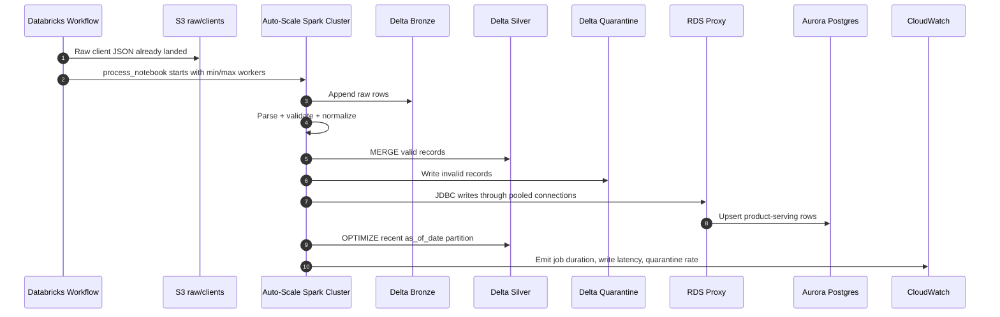
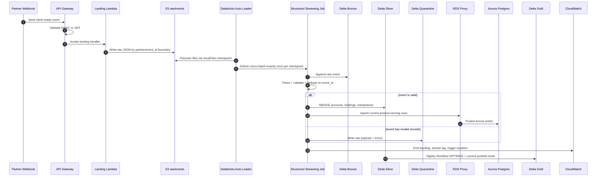
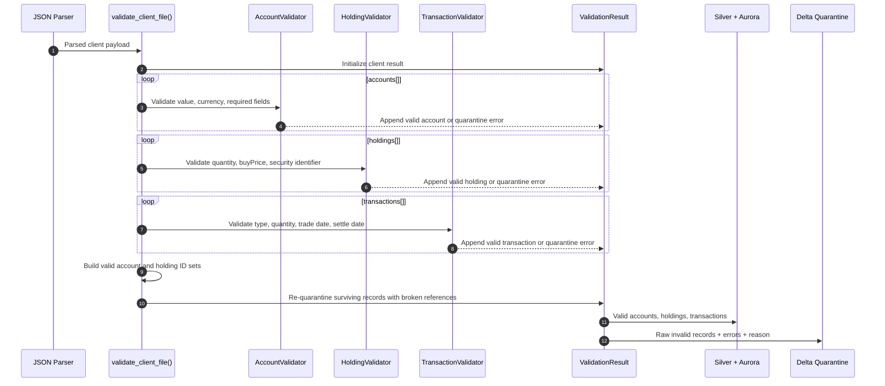

# Custodial Data Ingestion Use Case Flow

This flow is updated to match the three current architecture diagrams:

- `docs/diagrams/scale-1k.png`: daily Databricks Workflow batch pipeline.
- `docs/diagrams/scale-10k.png`: same batch pipeline with auto-scaling, RDS Proxy, and Delta `OPTIMIZE`.
- `docs/diagrams/scale-1m.png`: event-driven webhook landing plus Databricks Auto Loader and Structured Streaming.

The invariant across all three designs is the data contract: raw partner data is
stored durably before transformation, validation happens before Silver Delta or
Aurora writes, and bad sub-entities are quarantined instead of rejecting the
entire client payload.

## Scale 1k: Daily Batch Workflow

At 1,000 clients, the simple path is a single scheduled Databricks Workflow. The
main risk is not compute scale; it is losing replayability or writing untrusted
partner data into product tables.

### 1k Operating Notes

- Durable boundaries are `raw/zips/` and `raw/clients/`. A failed process step
  can replay from S3 without calling the partner again.
- Spark parallelizes per-client validation inside the processing task.
- Aurora writes are acceptable directly over JDBC at this scale.
- CloudWatch receives file counts, control totals, quarantine counts, and job
  duration from `reconcile_notebook`.

## Scale 10k: Auto-Scaled Batch

At 10,000 clients, the workflow shape stays the same. The changes are operational
knobs around throughput and write pressure.

### 10k Operating Notes

- The process task runs on a Databricks auto-scaling cluster.
- RDS Proxy protects Aurora from too many concurrent Spark JDBC connections.
- Delta `OPTIMIZE` runs after the write to compact small files in the active
  partition.
- Leading bottleneck signals are Databricks job duration, Aurora write latency,
  and quarantine-rate spikes.

## Scale 1m: Event-Driven Streaming

At 1,000,000 clients, the single daily ZIP is the wrong abstraction. The updated
design accepts one client-ready event at a time, lands raw JSON immediately, and
lets Auto Loader feed a Structured Streaming job.

### 1m Operating Notes

- The raw S3 event path is the replay checkpoint. A bad deploy can be replayed
  from `raw/events/partner=/event_id=/`.
- Auto Loader's checkpoint owns file discovery and prevents committed files from
  being reprocessed during normal operation.
- Delta `MERGE` on `event_id` provides idempotency at the table layer.
- Health is measured by backlog, stream lag, trigger duration, Aurora latency,
  and quarantine count.

## Validation Subflow

The same validation semantics apply in both batch and streaming modes. This maps
directly to `src/validate/validators.py`.

Key decisions:

- Validate at the ingestion boundary, before database writes.
- Validate accounts, holdings, and transactions independently.
- Run referential-integrity checks after field validation, using only surviving
  valid IDs.
- Preserve raw payloads, entity type, error details, and quarantine reason for
  data-quality review and replay.

## Skeleton Code Map

The starter code under `src/` follows the same boundaries:

| File | Role |
| --- | --- |
| `src/validate/validators.py` | Concrete boundary validator and demo payload. |
| `src/ingest/config.py` | Naming and settings for batch and event paths. |
| `src/ingest/partner_client.py` | Partner API interface for auth, request, poll, download. |
| `src/ingest/storage.py` | S3-style object-store interface and local filesystem adapter. |
| `src/ingest/batch_pipeline.py` | 1k/10k daily workflow skeleton from request to validation. |
| `src/ingest/streaming_pipeline.py` | 1m webhook landing and landed-event processing skeleton. |
| `src/ingest/sinks.py` | Delta, Aurora, and quarantine sink interfaces. |
| `src/ingest/reconcile.py` | Counts, control totals, and alert metrics skeleton. |
