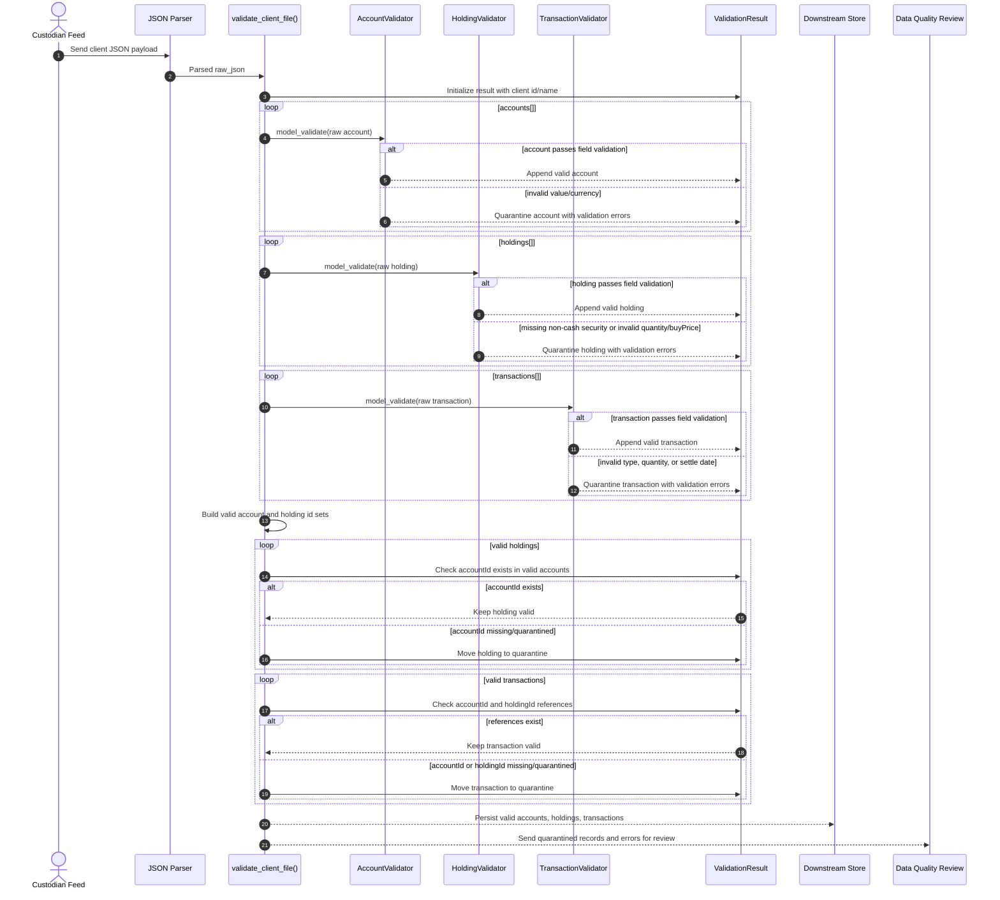

# Custodial Data Validation Use Case

This sequence flow shows how a raw custodian payload moves through the boundary
validation layer before any database write. The goal is to accept clean records,
quarantine bad sub-entities, and avoid rejecting an entire client because one
holding or transaction is malformed.

## Key Decisions

- Validation happens at the ingestion boundary, before database writes.
- Each sub-entity is validated independently, so one bad holding does not poison
  the rest of the client payload.
- Referential-integrity checks run only after field/model validation, using the
  surviving valid records as the trusted id set.
- Quarantined records retain the raw payload, entity type, error details, and
  quarantine reason so data quality issues can be reviewed and remediated.
